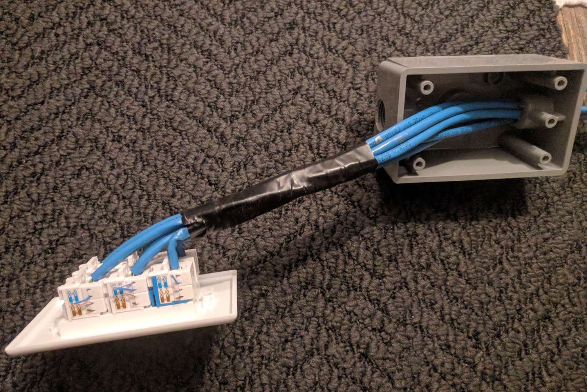
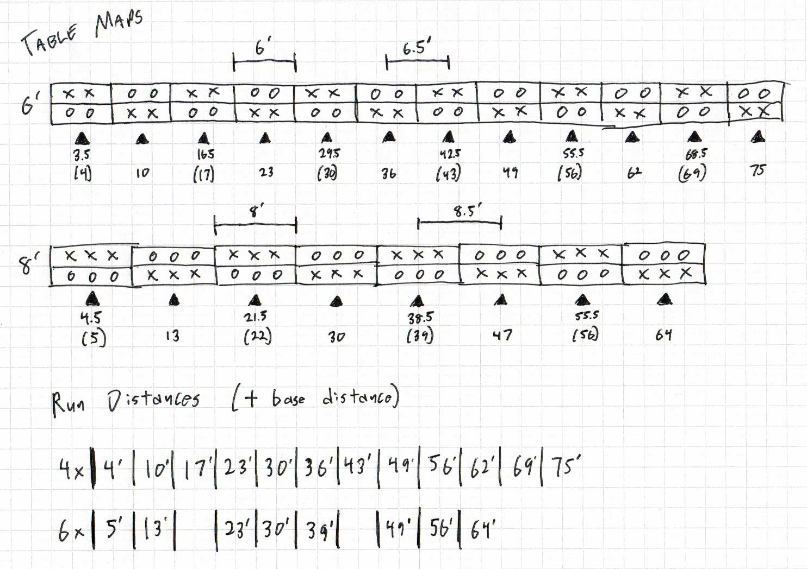

# Network Bundles

At [Laclede's LAN](https://lacledeslan.com) events we provide attendees network connections by using network bundles with individual 5' network cables plugged in. We prefer this to having attendees bring their own cables and/or plug directly into network since:

* Bundles are heaver than individual cables; pulling on the bundles doesn't put nearly as much stress on switch ports.
* We don't have to worry about having to troubleshoot or work around the length of attendee-provided network cables.
* We're able to keep switches further from attendees (providing more setup flexibility) and protected inside ["network crates"](./NetworkCrates.md).

## The Bundle

| Overview | Faceplate | Female End | Male End |
| :------- | :-------- | :--------- | :------- |
| TODO     | TODO      |  | TODO |

Notice that four of the lines are blue while two are white. For setups with four attendees per table-pair, the white lines can be left disconnected to reduce the ports used on the network switches.

## Length Chart

These are the lengths we use for our network bundles at Laclede's LAN. Lengths have been chosen as they work with both 6' and 8' table setups (see also: [optimization proof](#LL-Optimization-Proof)).

| Length | Raw Cat 5e |   | Length | Raw Cat 5e |
| ------ | ---------- |---| ------ | ---------- |
| 9'     | 54'        |   | 53'    | 318'       |
| 17'    | 102'       |   | 60'    | 360'       |
| 27'    | 162'       |   | 68'    | 408'       |
| 35'    | 210'       |   | 79'    | 474'       |
| 43'    | 258'       |   | 88'    | 528'       |

### Materials

For each bundle:

* Enough network cable to cover each run (use stranded cable for durability)
* 6x - male RJ45 heads
* 4x - blue female RJ45 jacks
* 4x - blue RJ45 boots
* 2x - white female RJ45 jacks
* 2x - white RJ45 boots
* 1x - Plastic T-Box 1/2'' 1-Gang
* 1x - 1 Gang 6-hole wall plate with 3/4'' holes
* 1x - NM 3/4'' clamp connector
* Electrical tape

### Tips

### The Process

1. Punch the hole out of the T-BOX and screw in the NM clamp connector.
2. Cut 6x cables to length; for two of the cables mark each end with a black sharpie (for the two "white" connections).
3. Bind the six cables together using electrical tape leaving 8'' of slack on each end. Feed through the box.
4. Add a female RJ45 jack to each cable you have threaded into the junction box; using white for the marked cables and blue for all others. 
5. Add the faceplate and wrap electrical tape to the bundle where it'll be pinched by the clamp connector when the faceplate has been screwed on. Tighten the faceplate to the T-Box.
6. Add the boots to the other end (white for marked cables; blue for all others).
7. Attach male ends. Test and label both the faceplate and the boots (A - D blue; E & F white).

## Additional & Addendums

### Some Math

Start with 4' of slack and add 1/2 a table length to get to the middle of the first table. For each additional row depth add 1/2' more slack and the total table depth.

```text
runLength = 4' slack + 1/2 table length + (1/2 * rowDepth) + (tableLength * (rowDepth - 1))
sixFootRun = 4' slack + 3' + (1/2 * rowDepth) + (6' * (rowDepth - 1))
eightFootRun = 4' slack + 4' + (1/2 * rowDepth) + (8' * (rowDepth - 1))
```

### LL Optimization Proof


